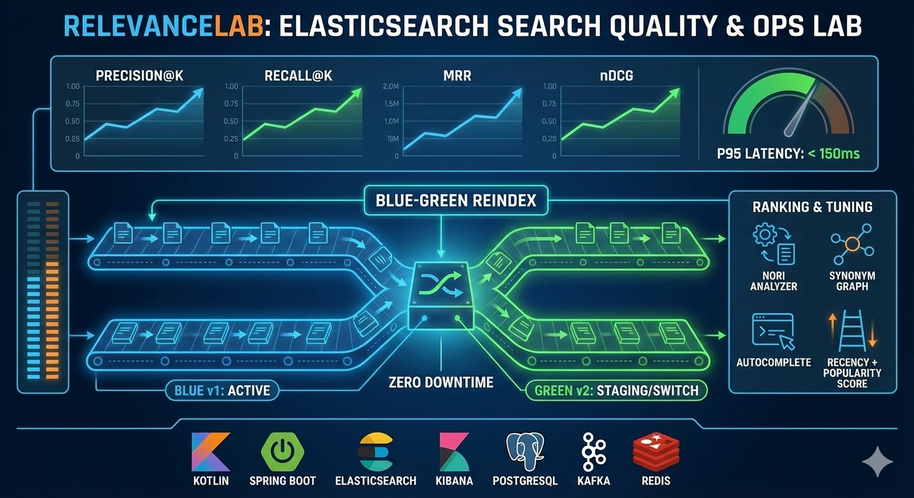

# SearchFoundry (Elasticsearch Search Quality & Ops Lab)

**검색 품질(Recall/Precision)·랭킹·한글 분석기 튜닝·무중단 리인덱스(Blue-Green)·성능/관측**까지 제품 수준으로 끝까지 파고드는 실험실 프로젝트입니다.

- 목표: 로컬 기준 **P95 검색 지연 < 150ms**를 염두에 두고, 품질/성능/운영을 함께 개선합니다.
- 스택: Kotlin + Spring Boot + Elasticsearch(+ Kibana) (+ PostgreSQL/Kafka/Redis는 확장 여지)



## 핵심 기능

- **검색/자동완성 API**: 가중치 검색(title^4, summary^2, body) + 필터 분리 + 하이라이트 + 자동완성(edge-ngram)
- **랭킹 보강**: 최신성(decay) + 인기도(`popularityScore`, `rank_feature`)를 결합하는 `function_score`
- **평가 파이프라인**: QuerySet/JudgementSet 기반으로 Precision@K/Recall@K/MRR/nDCG@K 산출 + 리포트 생성
- **운영 자동화**: alias 기반 **Blue-Green Reindex**(생성→reindex→검증→스위치→보관 manifest) + 즉시 롤백
- **성능/관측**: 고정 QuerySet으로 P50/P95/QPS 벤치마크 + (선택) profile/slowlog 수집 리포트

## 문서/가이드

- Kibana로 Baseline 품질 확인: `docs/baseline/kibana-baseline.md`
- 평가 데이터 스키마: `docs/eval/README.md`
- 회귀 평가 파이프라인: `docs/eval/regression-pipeline.md`
- 블루그린 reindex 운영 자동화: `docs/ops/reindex-automation.md`
- 검색 성능 벤치마크 가이드: `docs/ops/performance-benchmark.md`

## 아키텍처/레이어(패키지)

의존성 방향은 아래 순서를 유지합니다(순환 참조 금지).

- `com.searchfoundry.api`: Controller/DTO/Validation
- `com.searchfoundry.core`: 도메인 모델, 유스케이스/서비스, 검색·평가 정책
- `com.searchfoundry.index`: 인덱스/매핑/분석기 정의, alias 스위치, reindex 오케스트레이션
- `com.searchfoundry.eval`: 평가 러너, 지표 계산, 리포트 생성
- `com.searchfoundry.support`: 예외/응답 모델, 공통 설정, 외부 클라이언트 포트

## Elasticsearch 인덱스 설계(요약)

- 인덱스명: `docs_v{version}` (예: `docs_v1`, `docs_v2`)
- Alias:
  - read: `docs_read`
  - write: `docs_write`
- 매핑/설정 키포인트:
  - `dynamic: strict`로 스키마 통제(운영 사고 방지)
  - `popularityScore: rank_feature`로 랭킹 신호 반영
  - 검색용 `text` + 필터/정렬용 `keyword` multi-field 분리
  - 한글 분석기: nori + user_dictionary + (선택) synonym_graph
- 인덱스 템플릿(JSON): `src/main/resources/elasticsearch/index/docs_v1.json`, `src/main/resources/elasticsearch/index/docs_v2.json`
- 사용자 사전/동의어 파일(로컬 Docker에서 ES에 마운트):
  - `analysis/userdict_ko.txt`
  - `analysis/synonyms_ko.txt`

## 빠른 시작(로컬)

### 0) 사전 준비
- JDK 21(Gradle toolchain 기준)
- Docker Desktop(or Docker Engine + Compose v2)

### 1) Elasticsearch/Kibana 실행
```bash
cd docker
docker compose up -d
```
- Elasticsearch: http://localhost:9200
- Kibana: http://localhost:5601

### 2) 애플리케이션 실행(+ 인덱스/alias 부트스트랩)
`app.index.bootstrap.enabled=true`로 기동하면 `docs_v{version}` 생성 후 `docs_read/docs_write`를 원자적으로 연결합니다.

```bash
APP_INDEX_BOOTSTRAP_ENABLED=true \
APP_INDEX_BOOTSTRAP_VERSION=1 \
./gradlew bootRun
```

### 3) 샘플 데이터 Bulk 색인
```bash
curl -X POST "http://localhost:8080/admin/index/bulk" \
  -H "Content-Type: application/json" \
  -d '{"documents": '$(cat docs/data/sample_documents.json)'}'
```

### 4) 검색/자동완성 호출
```bash
curl "http://localhost:8080/api/search?q=쿠버네티스%20인그레스&size=3"
curl "http://localhost:8080/api/suggest?q=쿠버네티스&size=5"
```

### 5) Baseline 평가 리포트 생성
QuerySet/JudgementSet은 `docs/eval/querysets/*.json`, `docs/eval/judgements/*.json`에 있습니다.

```bash
./scripts/run-baseline-eval.sh
```

### 6) 회귀 평가(기준 리포트 대비)
기본 기준선은 `eval.regression.baseline-report-id`(기본: `20251226_055824`)로 관리합니다.

```bash
./scripts/run-regression-eval.sh
```

### 7) 블루그린 reindex(검증 포함) + 필요 시 롤백
```bash
# docs_v1 -> docs_v2 전환 예시
./scripts/blue-green-reindex.sh 1 2
```
- 검증/스위치/보관 manifest까지 한 번에 수행합니다. 상세는 `docs/ops/reindex-automation.md`를 참고하세요.

### 8) 검색 성능 벤치마크(P50/P95/QPS)
```bash
./scripts/run-performance-benchmark.sh
```
- 리포트는 `reports/performance/{reportId}/`에 생성됩니다.

## 주요 API(요약)

- Public
  - `GET /api/search` (q, category, author, tags, sort, page, size, publishedFrom, publishedTo)
  - `GET /api/suggest` (q, category, size)
  - `GET /api/health`
- Admin/Ops
  - `POST /admin/index/create?version=1`
  - `POST /admin/index/bulk`
  - `POST /admin/index/reindex`
  - `POST /admin/index/rollback`
  - `POST /admin/eval/run?datasetId=baseline&topK=10&worstQueries=20&generateReport=true`
  - `POST /admin/eval/regression`
  - `POST /admin/eval/experiments/analyzer`
  - `POST /admin/performance/benchmark`
  - `POST /admin/observability/search`

## 테스트

```bash
./gradlew test
```
- 통합 테스트는 Testcontainers를 사용하므로 Docker가 필요합니다.

## 운영/보안 참고

- 로컬 개발 편의를 위해 `docker/docker-compose.yml`은 Elasticsearch 보안을 비활성화(`xpack.security.enabled=false`)합니다. 운영 환경에서는 보안 설정을 별도로 적용하세요.
